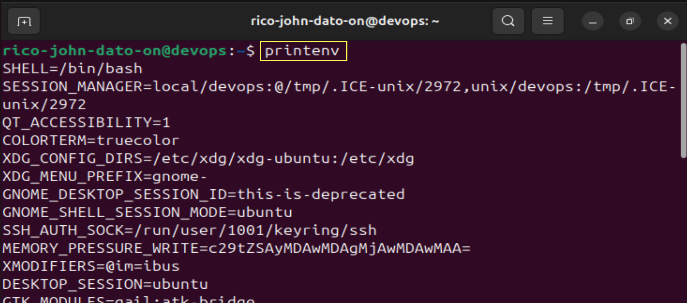
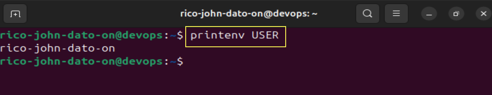
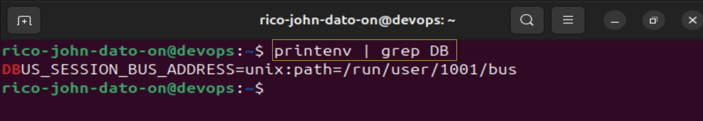
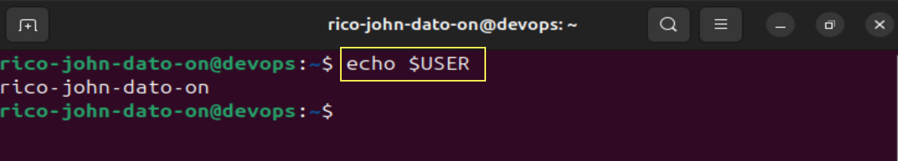
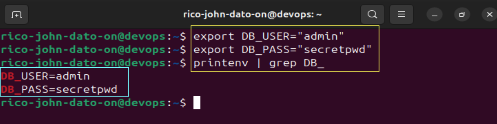
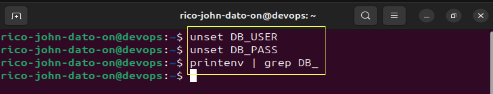
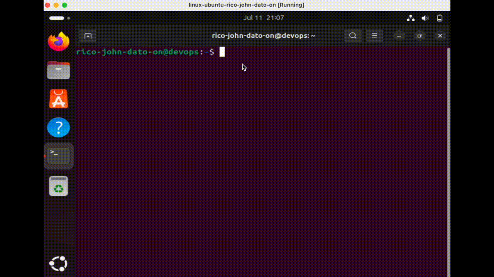
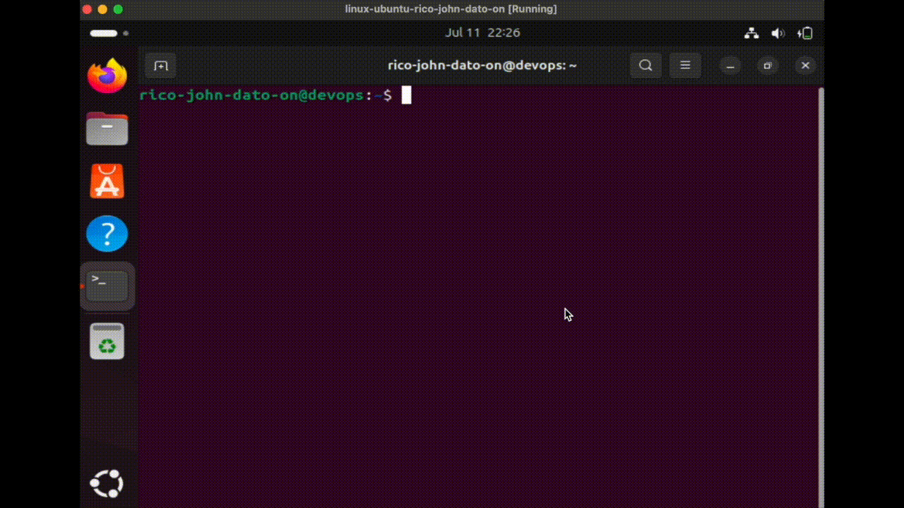

# Linux Environment Variables & Bash Scripting

This README contains summarized notes and examples based on a comprehensive lecture on environment variables and bash scripting in Linux.

---

## 🧠 Concepts Covered

### 1. **Environment Variables**

- Key-value pairs defined for user or system configuration.
- Common variables:
  - `USER`: Current logged-in user.
  - `HOME`: User's home directory.
  - `SHELL`: Default shell program (`/bin/bash`, `/bin/zsh`, etc.).
  - `PATH`: List of directories with executable programs.

### 2. **Viewing Environment Variables**

```bash
printenv             # List all environment variables=
```



```bash
printenv USER        # Display value of a specific variable
```



```bash
printenv | grep DB   # Filter environment variables by keyword
```



### 3. **Referencing Environment Variables**

```bash
echo $USER           # Using in shell
```



### 4. **Creating/Exporting Environment Variables**

```bash
export DB_USER="admin"
export DB_PASS="secretpwd"

printenv | grep DB_
```



### 5. **Unsetting Environment Variables**

```bash
unset DB_USER
unset DB_PASS

printenv | grep DB_
```



### 6. **Persisting Environment Variables**

- **Per User**: Add to `~/.bashrc`

```bash
export DB_USERNAME=rico
export DB_PASS=secretpwd
```

- Reload with:

```bash
source ~/.bashrc
```



---

## 🔐 Why Use Environment Variables?

- Securely pass secrets (API keys, DB creds) to applications.
- Configure software for multiple environments (dev, test, prod).
- Avoid hardcoding sensitive or environment-specific data in code.

---

## 📁 Modifying $PATH and Add a custom command/program



### Bash Script Example

```bash
vim greet
```

```bash
#!/bin/bash

echo "Hello World"
```

### Allow all users to run the script

```bash
chmod a+x greet
```

### Add PATH to all users

```bash
vim .bashrc
```

Add this inside .bashrc

```bash
export PATH="$PATH:/home/rico-john-dato-on"
```

```bash
source .bashrc
```

or can be access globally by updating the PATH of /etc/environment

Then run your script:

```bash
greet
```

## 💡 Summary

- Use `export` for temporary variables.
- Use `.bashrc` or `/etc/environment` for permanent ones.
- Use `printenv`, `grep`, and `$VAR` to read values.
- Securely store credentials and config options.

Environment variables make your scripts portable, configurable, and secure.

🧑‍💻 _Created by Rico John Dato-on_  
🔗 [LinkedIn](https://www.linkedin.com/in/rico-john-dato-on) • [Portfolio](https://ricodatoon.netlify.app)
